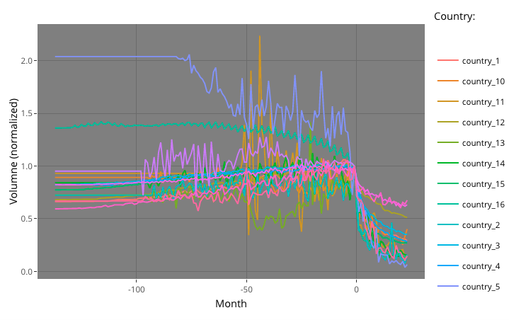

# novartisDatathon

This repo was used by our team for the 2020 [Novartis Datathon](https://godatathon.com/), in which we scored 3rd place out of 60 international teams of data scientists. It collects all code used for prediction and presentation purposes. Our team consisted of four class mates who at the time of the event were studying for an MSc Data Science at [Barcelona Graduate School of Economics](https://www.barcelonagse.eu/study/masters-programs/data-science-methodology):

- Patrick Altmeyer
- Eduard Gimenez
- Jakob Pörschmann
- Simon Neumeyer

For all of us this was our first ever participation in a datathon/hackathon and an incredibly rewarding experience. 

## Challenge

The challenge involved predicting drug sales after the entrance of generic substitutes for different countries and brands - see below the aggregated and normalized time series. For our predictions we used XGBoost recursively. 

